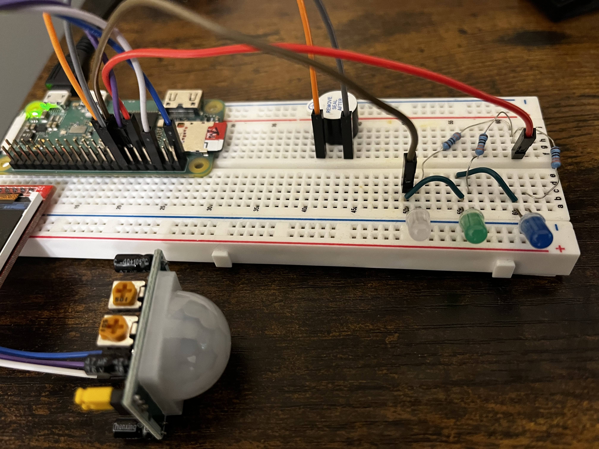
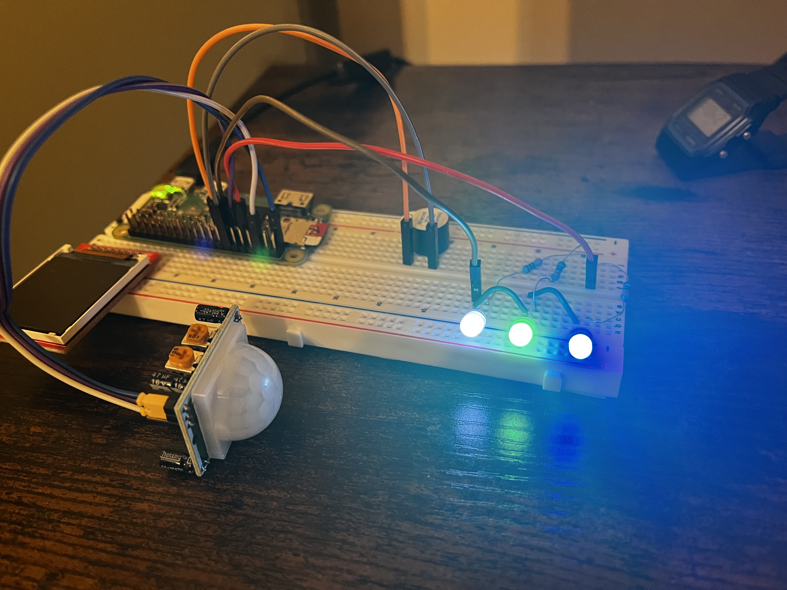

# 🔔 Raspberry Pi Zero 2 W Motion-Activated Alarm System

A beginner-friendly Raspberry Pi IoT project that uses a **PIR motion sensor**, **LED**, and **active buzzer** to create a simple alarm system that reacts to movement.

---

## 📸 Project Photos




---

## 🧠 How It Works

- The PIR sensor detects motion in a room.
- When movement is detected:
  - LED turns on.
  - Buzzer activates.
- After 5 seconds, both turn off.
- System pauses for 2 seconds, then resumes monitoring.

---

## 📦 Components Required

| Component             | Quantity |
|-----------------------|----------|
| Raspberry Pi Zero 2 W | 1        |
| HC-SR501 PIR Sensor   | 1        |
| Active Buzzer         | 1        |
| LED (any color)       | 1        |
| 330Ω Resistor         | 1        |
| Breadboard + Jumper Wires | 1 set |

---

**GPIO Pin Mapping**

| GPIO (BCM) | Physical Pin | Function           |
|------------|---------------|--------------------|
| GPIO17     | Pin 11        | PIR OUT            |
| GPIO27     | Pin 13        | LED + Resistor     |
| GPIO22     | Pin 15        | Buzzer +           |
| GND        | Pins 6 & 9    | Ground             |
| 3.3V       | Pin 1         | PIR VCC            |

---

## 🐍 Python Code

Save the following as `motion_alarm.py`:

`motion-led-buzzer.py`

---

## 🧪 Setup Instructions

### 1. Clone the Repo
```bash
git clone https://github.com/yourusername/motion-buzzer-alarm.git
cd motion-buzzer-alarm
```

### 2. Install Dependencies
```bash
pip3 install -r requirements.txt
```

### 3. Run the Script
```bash
python3 motion_alarm.py
```

---

## 🌱 Future Ideas

- Take a photo when motion is detected (add Pi Camera)
- Send Telegram or Email alerts
- Log detection events with timestamps
- Add toggle via web interface

---

## 📜 License

MIT License

---

> ✨ Feel free to contribute or fork this project!
